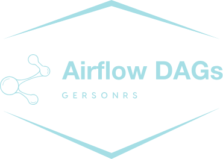

<!--
*** Obrigado por estar vendo o nosso README. Se você tiver alguma sugestão
*** que possa melhorá-lo ainda mais dê um fork no repositório e crie uma Pull
*** Request ou abra uma Issue com a tag "sugestão".
*** Obrigado novamente! Agora vamos rodar esse projeto incrível : D
-->

<!-- PROJECT SHIELDS -->

[](https://img.shields.io/badge/type-Open%20Project-green)
[](https://github.com/GersonRS/airflow-dags/commits/master)
[](https://github.com/GersonRS/airflow-dags/issues)
[](https://github.com/GersonRS/airflow-dags/search?l=python)
[](https://img.shields.io/github/repo-size/GersonRS/airflow-dags)
[](https://img.shields.io/github/contributors/GersonRS/airflow-dags)
[](https://img.shields.io/github/stars/GersonRS/airflow-dags)
[](LICENSE)
[](https://img.shields.io/badge/status-active-success.svg)

<p align="center">
  
</p>

<!-- PROJECT LOGO -->

# Hands-on Test Airflow Dags

Esse é um repositório de DAGs do Apache Airflow com foco em exemplos de testes e mocking para interações com sistemas externos.

# Tabela de Conteúdo
* [Tabela de Conteúdo](#tabela-de-conteúdo)
* [Objetivo](#objetivo)
* [Fluxo de versionamento](#fluxo-de-versionamento)
* [Ferramentas](#ferramentas)
* [Como Usar](#como-usar)
  + [Instalação](#instalação)
  + [Observações](#observações)
* [Estrutura do Projeto](#estrutura-do-projeto)
* [Requisitos](#requisitos)
* [Contribuições](#contribuições)
* [Licença](#licença)
* [Contato](#contato)

# Objetivo

O objetivo deste repositório é fornecer exemplos de DAGs e scripts de testes para o Apache Airflow, com foco em práticas de mocking para interações com sistemas externos. Esses exemplos são úteis para garantir a confiabilidade e robustez dos fluxos de trabalho (DAGs) que interagem com esses serviços.

# Fluxo de versionamento

Projeto segue regras de versionamento [gitflow](https://www.atlassian.com/br/git/tutorials/comparing-workflows/gitflow-workflow).

# Ferramentas

O repositório inclui um conjunto de ferramentas e bibliotecas para testes de DAGs no Airflow, incluindo o uso de mocking para sistemas externos. Abaixo estão as principais tecnologias utilizadas:

* [Python](https://www.python.org/) - Linguagem de programação utilizada para os scripts e testes dos DAGs.
* [Poetry](https://python-poetry.org/) - Ferramenta de gerenciamento de dependências.
* [psycopg2-binary](https://pypi.org/project/psycopg2-binary/) - Driver para conectar ao PostgreSQL.
* [boto3](https://boto3.amazonaws.com/v1/documentation/api/latest/index.html) - Biblioteca da AWS SDK para Python, usada para interação com MinIO/S3.
* [moto](https://github.com/spulec/moto) - Biblioteca que permite mockar serviços da AWS, usada aqui para simular o MinIO.

# Como Usar

Para usar este repositório, faça um fork ou clone do projeto e siga as instruções abaixo para configurar e rodar os testes de DAGs.

## Instalação

Faça o clone do repositório e instale as dependências usando o Poetry:

```sh
poetry install
```

Para rodar os testes com mocking para sistemas externos, é necessário instalar o Docker, que será utilizado como ambiente para os testes de integração.

## Observações

* Certifique-se de ter as ferramentas listadas em [Ferramentas](#ferramentas) instaladas corretamente em seu sistema.
* Execute os testes antes de implantar suas DAGs em produção para garantir a integridade dos pipelines.

# Estrutura do Projeto

A estrutura do projeto é organizada da seguinte maneira:

```bash
.
├── dags
│   ├── spark_jobs
│   ├── src
│   └── utils
├── data
├── include
├── plugins
└── tests
    └── dags
```

* **[dags](/dags/)** - Diretório contendo as DAGs do Airflow, responsáveis por definir fluxos de trabalho de data pipelines.
* **[tests](/tests/)** - Contém os scripts de testes para DAGs, com exemplos de mocking para sistemas externos.

# Requisitos

Para usar este repositório, você precisa ter o Git, Python e Poetry instalados. O Docker também é necessário para rodar os testes de integração. As instruções para instalar o Docker podem ser encontradas em https://www.docker.com/get-started.

# Contribuições

Contribuições são bem-vindas! Sinta-se à vontade para criar um pull request com melhorias e correções de bugs.

1. Faça um Fork do projeto.
2. Crie uma Branch para sua Feature (`git checkout -b feature/FeatureIncrivel`)
3. Adicione suas mudanças (`git add .`)
4. Comite suas mudanças (`git commit -m 'Adicionando uma Feature incrível!'`)
5. Faça o Push da Branch (`git push origin feature/FeatureIncrivel`)
6. Abra um Pull Request.

<!-- LICENSE -->

# Suporte

Entre em contato comigo em um dos seguintes lugares:

* Linkedin em [Gerson Santos](https://www.linkedin.com/in/gersonrsantos/)
* Instagram [gersonrsantos](https://www.instagram.com/gersonrsantos/)

---

# Licença


Distribuído sob a licença MIT. Veja [LICENSE](LICENSE) para mais informações.

# Contato

Me acompanhe nas redes sociais.

<p align="center">

 <a href="https://twitter.com/gersonrs3" target="_blank" >
     </a>
  <a href="https://instagram.com/gersonrsantos" target="_blank" >
    </a>
  <a href="https://www.linkedin.com/in/gersonrsantos/" target="_blank" >
    </a>
  <a href="https://t.me/gersonrsantos" target="_blank" >
    </a>
  <a href="mailto:gersonrodriguessantos8@gmail.com" target="_blank" >
    </a>
</p>

---

Feito com ❤️ by **Gerson**
